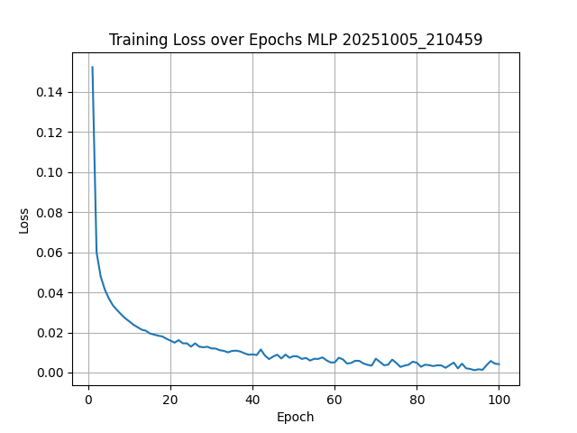
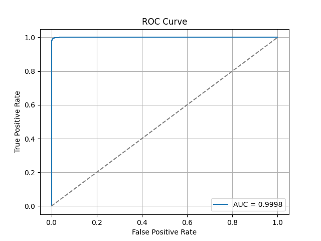
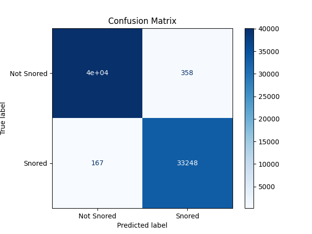

# Artificial Neural Networks and Deep Learning
**Implementation of a Multi-Layer Perceptron from scratch to identify snoring from audio.**

Jerônimo de Abreu Afrange

## Data Selection

Private dataset of polysomnography exams. To access the dataset contact me.

It contains polysomnography data of a few hundred patients, divided into over a thousand files, totalling over a thousand hours of examination.

The exam data consists of multiple time-series, including room audio and a snore signal, which are the two time-series of interest. The features will be extracted from the audio and the labels from the snore signal.

This dataset was selected because it can be a significant challenge.

## Dataset Explanation

The features and labels must be extracted from the raw data. To do that, a lot of pre-processing is needed. In short, the audio and snore signal are divided into frames of a given size and a given hop from the start of one frame to the start of another. For each audio frame, several audio metrics are calculated, and for each snore signal frame, the RMS intensity. After that, every sequence of frames of a given number of frames is combined into one big frame by averaging the values of each extracted metric. At that point, the target variable will be split into two categories using a threshold. Ultimately, there will be 46 numerical features and one categorical target.

### Potential Issues

For it being an audio signal and for the nature of the problem, imbalance and noise will be the biggest issues with the dataset. Imbalance because people don't snore half the time they're sleeping and noise due to the nature of the data, that is raw audio.

Also, because of how the audio was taken, it is only suitable for snore detection in controlled environments (no mundane noises such as motorcylces passing in the street or dogs barking in the samples).

### Data Sampling

The complete dataset is way too large for this project, because of that, only a small part of the data will be used. Futher details later.

## Pre-processing

The snore signal is a filtered audio signal extracted from secondary audio recorded by a tracheal contact microphone during the examination. The resulting signal is an audio signal with 500Hz sample rate. The intensity of the signal represents the intensity of the snore, for that, the intensity in dB will be computed. The intensity threshold will be based on human hearing thresholds.

Pre-processing settings located in ```settings.toml```

### Data Cleaning

Every audio and snore signal in every file is hashed to identify repeated data. Repeated data is then removed from the dataset.

### Feature Extraction

**Parameters:**
- Frame size: 52ms -> 2496 audio samples @ 48kHz sample rate -> 26 snore samples @ 500Hz
- Frame hop: 26ms -> 1248 audio samples @ 48kHz sample rate -> 13 snore samples @ 500Hz
- Frame sequence size: 10 frames
- Frame sequence hop: 1 frame
- Audio intensity FS to SPL: +50dB
- Intensity threshold: 20dB -> -30dBFS - fairly faint sound level

There will be considerable frame and sequence overlap, meaning, information will be repeated, which sounds like a problem but is standard practice for audio processing.

#### Logic

1. **Audio and Snore Signal Extraction**
    - Read all EDF files of a given patient;
    - Create an audio file for each complete audio interval for each patient (EDF files in the middle may be corrupted or missing, ideally, one audio file per patient);
    - Repeat for the snore signal.

2. **Frame Extraction**
    - Go through every input audio calculating the metrics below at every frame:
        - RMS Intensity (intensity of the audio);
        - Zero-Crossing Rate (rate at which the audio signal crosses zero);
        - Spectral Centroid (main frequency of the audio);
        - Spectral Bandwidth (variety of the frequencies of the audio);
        - Spectral Rolloff (frequency below which most of the energy is);
        - Spectral Flatness (high indicates noise-like audio, low indicates tone-like audio);
        - Spectral Flux (measure how much the spectrum is changing between frames);
        - 13 Mel-Frequency Cepstral Coefficients (MFCCs);
        - 13 MFCCs First Derivative;
        - 13 MFCCs Second Derivative.
    - Store the results in a separate parquet;
    - Go through every snore signal calculating the signal intensity in dB at every frame;
    - Store the results in a separate parquet.

3. **Frame Combination**
    - Go through every sequence of $n$ frames (defined in the pre-processing parameters) aggregating the metrics by taking the mean of each feature, both for audio and snore signal;
    - Store the results in a separate parquet.

4. **Category Splitting:** apply the threshold to the intensity of the snore signal;

See deatailed implementation in ```src/process.py```.

## Data Sampling

The data for the four patients with the most balanced snore occurence were used. Two of them will be used for training and two for testing.

**Patient IDs:**
- ```1593 - 46.6% positive @ -30 dBFS threshold```
- ```1193 - 42.6% positive @ -30 dBFS threshold```
- ```1402 - 42.2% positive @ -30 dBFS threshold```
- ```1480 - 42.2% positive @ -30 dBFS threshold```

Overall, the entire dataset is $\sim44.1\%$ positive for snoring, so not that unbalanced, although I might have cherry picked here.

The 4 patients combined yield ```2528086``` samples, which is way too much data for this project. Before training, a fraction of the samples will be used.

### Implementation:

See implementation in the source code: ```src/process.py```

### Descriptive Statistics

- Number of samples (frame sequences): ```2528086```
- Number of features: ```46```

|       |          rms |          zcr |          scr |          sbw |          srf |
|-------|--------------|--------------|--------------|--------------|--------------|
| mean  | 6.946543e-02 | 2.025593e-02 | 3.048144e+03 | 5.065415e+03 | 7.432037e+03 |
| std   | 1.658174e-01 | 2.232365e-02 | 1.370506e+03 | 1.336699e+03 | 4.028298e+03 |
| min   | 6.103516e-05 | 0.000000e+00 | 6.410256e+00 | 9.065472e+00 | 1.923077e+01 |
| 25%   | 2.134048e-02 | 8.173077e-03 | 2.129306e+03 | 4.466660e+03 | 4.426923e+03 |
| 50%   | 3.323837e-02 | 1.494391e-02 | 2.895665e+03 | 5.247815e+03 | 7.407692e+03 |
| 75%   | 4.857050e-02 | 2.435897e-02 | 4.056393e+03 | 6.077480e+03 | 1.106731e+04 |
| max   | 9.999695e-01 | 3.629808e-01 | 1.072635e+04 | 8.266863e+03 | 2.026346e+04 |

|       |          sfl |          sfx |       mfcc_1 |    mfcc_d1_1 |    mfcc_d2_1 |
|-------|--------------|--------------|--------------|--------------|--------------|
| mean  | 3.536819e-03 | 1.137875e-01 |-3.511356e+02 | 3.652681e-05 | 9.354787e-06 |
| std   | 8.657358e-03 | 4.095587e-02 | 6.845554e+01 | 2.511002e+00 | 5.053847e-01 |
| min   | 6.802935e-14 | 0.000000e+00 |-5.003084e+02 |-2.770448e+01 |-8.523362e+00 |
| 25%   | 5.615261e-04 | 9.303173e-02 |-3.883255e+02 |-3.537835e-01 |-9.582837e-02 |
| 50%   | 1.578096e-03 | 1.158809e-01 |-3.553980e+02 | 1.595079e-15 | 0.000000e+00 |
| 75%   | 3.568126e-03 | 1.386833e-01 |-3.176903e+02 | 3.124535e-01 | 1.029346e-01 |
| max   | 3.645288e-01 | 3.416165e-01 |-2.429064e+01 | 2.797769e+01 | 6.723682e+00 |

|       |       mfcc_2 |    mfcc_d1_2 |    mfcc_d2_2 |       mfcc_3 |    mfcc_d1_3 |
|-------|--------------|--------------|--------------|--------------|--------------|
| mean  | 8.750448e+01 | 1.342623e-05 | 6.279053e-06 | 3.173873e+01 | 3.281029e-07 |
| std   | 2.876764e+01 | 8.426872e-01 | 2.089713e-01 | 1.944139e+01 | 9.109347e-01 |
| min   |-1.590306e+01 |-1.158623e+01 |-4.878820e+00 |-8.024688e+01 |-9.927807e+00 |
| 25%   | 7.757322e+01 |-2.406620e-01 |-7.926249e-02 | 2.172712e+01 |-2.216530e-01 |
| 50%   | 8.799329e+01 |-3.469186e-17 | 0.000000e+00 | 3.517553e+01 | 0.000000e+00 |
| 75%   | 1.106422e+02 | 2.151376e-01 | 7.956264e-02 | 4.608531e+01 | 2.577950e-01 |
| max   | 2.076283e+02 | 1.462873e+01 | 3.896981e+00 | 9.616373e+01 | 7.994034e+00 |

|      |     mfcc_d2_3 |       mfcc_4 |    mfcc_d1_4 |    mfcc_d2_4 |       mfcc_5 |
| -----|---------------|--------------|--------------|--------------|--------------|
| mean | -7.973772e-07 | 2.848577e+01 | 6.703209e-07 |-1.029318e-06 | 1.347516e+01 |
| std  |  2.149395e-01 | 1.033496e+01 | 5.530807e-01 | 1.423061e-01 | 7.439431e+00 |
| min  | -3.100573e+00 |-3.876145e+01 |-6.593979e+00 |-2.065402e+00 |-3.864419e+01 |
| 25%  | -7.818899e-02 | 2.441636e+01 |-1.877678e-01 |-6.871693e-02 | 8.884882e+00 |
| 50%  |  2.220446e-16 | 2.834383e+01 | 0.000000e+00 | 1.110223e-16 | 1.287748e+01 |
| 75%  |  7.581646e-02 | 3.263236e+01 | 2.131808e-01 | 7.000859e-02 | 1.745996e+01 |
| max  |  2.983829e+00 | 8.476679e+01 | 6.825572e+00 | 2.320544e+00 | 6.448946e+01 |

|      |     mfcc_d1_5 |    mfcc_d2_5 |       mfcc_6 |    mfcc_d1_6 |    mfcc_d2_6 |
|------|---------------|--------------|--------------|--------------|--------------|
| mean | -1.480706e-05 | 7.897245e-07 | 1.242100e+01 |-1.467282e-05 |-8.269129e-08 |
| std  |  4.142498e-01 | 1.213063e-01 | 7.503138e+00 | 3.814778e-01 | 1.106113e-01 |
| min  | -6.165540e+00 |-1.572189e+00 |-2.431013e+01 |-4.526978e+00 |-1.346129e+00 |
| 25%  | -1.797480e-01 |-6.445467e-02 | 7.555290e+00 |-1.700879e-01 |-6.228237e-02 |
| 50%  | -3.465268e-17 | 2.220446e-16 | 1.053186e+01 |-3.462918e-17 | 2.220446e-16 |
| 75%  |  1.770132e-01 | 6.492195e-02 | 1.707788e+01 | 1.690820e-01 | 6.191126e-02 |
| max  |  5.429367e+00 | 1.953359e+00 | 7.059439e+01 | 4.641997e+00 | 1.501974e+00 |

|      |        mfcc_7 |    mfcc_d1_7 |    mfcc_d2_7 |       mfcc_8 |    mfcc_d1_8 |
|------|---------------|--------------|--------------|--------------|--------------|
| mean |  1.029713e+01 |-2.994441e-06 |-2.701240e-06 | 1.261222e+01 |-1.139755e-06 |
| std  |  4.824733e+00 | 3.448427e-01 | 1.042324e-01 | 6.118224e+00 | 3.617260e-01 |
| min  | -3.638394e+01 |-4.371626e+00 |-1.181844e+00 |-2.497977e+01 |-3.494827e+00 |
| 25%  |  8.070914e+00 |-1.577806e-01 |-5.976760e-02 | 9.324008e+00 |-1.641212e-01 |
| 50%  |  1.066187e+01 |-3.460046e-17 | 0.000000e+00 | 1.145123e+01 |-3.456654e-17 |
| 75%  |  1.310738e+01 | 1.608435e-01 | 5.937008e-02 | 1.382584e+01 | 1.596215e-01 |
| max  |  4.453627e+01 | 4.273671e+00 | 1.311420e+00 | 4.957725e+01 | 4.397038e+00 |

|      |     mfcc_d2_8 |       mfcc_9 |    mfcc_d1_9 |    mfcc_d2_9 |      mfcc_10 |
|------|---------------|--------------|--------------|--------------|--------------|
| mean | -2.284727e-06 | 8.459006e+00 |-5.624982e-06 |-1.746406e-06 | 6.335225e+00 |
| std  |  1.059232e-01 | 4.239938e+00 | 3.063613e-01 | 9.709023e-02 | 4.793646e+00 |
| min  | -1.418472e+00 |-2.595594e+01 |-3.837593e+00 |-1.057380e+00 |-3.631389e+01 |
| 25%  | -5.934562e-02 | 6.784487e+00 |-1.535132e-01 |-5.797405e-02 | 5.025168e+00 |
| 50%  |  1.110223e-16 | 8.811673e+00 |-3.452741e-17 | 1.110223e-16 | 7.359108e+00 |
| 75%  |  5.965534e-02 | 1.063706e+01 | 1.520561e-01 | 5.777375e-02 | 9.330295e+00 |
| max  |  1.407355e+00 | 3.930876e+01 | 3.464969e+00 | 1.156945e+00 | 3.133111e+01 |

|      |    mfcc_d1_10 |   mfcc_d2_10 |      mfcc_11 |   mfcc_d1_11 |   mfcc_d2_11 |
|------|---------------|--------------|--------------|--------------|--------------|          
| mean |  2.067197e-06 |-1.575414e-06 | 6.815808e+00 | 5.316644e-06 |-1.200218e-06 |
| std  |  3.290177e-01 | 1.000200e-01 | 5.420927e+00 | 3.029128e-01 | 9.647976e-02 |
| min  | -3.666452e+00 |-1.045401e+00 |-2.305026e+01 |-3.172295e+00 |-1.311544e+00 |
| 25%  | -1.534580e-01 |-5.864038e-02 | 3.072271e+00 |-1.514496e-01 |-5.784526e-02 |
| 50%  | -3.448308e-17 | 3.330669e-16 | 7.754418e+00 |-3.443355e-17 | 1.110223e-16 |
| 75%  |  1.615274e-01 | 5.839157e-02 | 9.924795e+00 | 1.578226e-01 | 5.771639e-02 |
| max  |  3.177442e+00 | 9.336084e-01 | 3.865219e+01 | 4.609034e+00 | 1.398301e+00 |

|      |       mfcc_12 |   mfcc_d1_12 |   mfcc_d2_12 |      mfcc_13 |   mfcc_d1_13 |
|------|---------------|--------------|--------------|--------------|--------------|
| mean |  6.749434e+00 | 3.910085e-06 |-1.047736e-06 | 8.130739e+00 | 2.553572e-06 |
| std  |  5.293590e+00 | 2.911771e-01 | 9.402501e-02 | 4.743183e+00 | 2.783962e-01 |
| min  | -2.464694e+01 |-3.364118e+00 |-1.009302e+00 |-3.430769e+01 |-5.091329e+00 |
| 25%  |  2.514756e+00 |-1.542204e-01 |-5.732478e-02 | 5.266319e+00 |-1.495054e-01 |
| 50%  |  7.570336e+00 |-3.437884e-17 | 2.220446e-16 | 7.848314e+00 |-3.431895e-17 |
| 75%  |  1.024292e+01 | 1.487566e-01 | 5.700165e-02 | 1.101977e+01 | 1.482305e-01 |
| max  |  3.780820e+01 | 3.444784e+00 | 1.113732e+00 | 4.012176e+01 | 4.220291e+00 |

|      |    mfcc_d2_13 |       snored |
|------|---------------|--------------|
| mean | -1.330541e-06 | 4.405965e-01 |
| std  |  9.176523e-02 | 4.964588e-01 |
| min  | -1.089065e+00 | 0.000000e+00 |
| 25%  | -5.623573e-02 | 0.000000e+00 |
| 50%  |  1.110223e-16 | 0.000000e+00 |
| 75%  |  5.599479e-02 | 1.000000e+00 |
| max  |  1.780254e+00 | 1.000000e+00 |

### Normalization

With the samples picked, the patients are split randomly for training and testing data. The data of the two training patients is combined and the z-score of each feature calculated. After that, the features of the testing group are normalized using the training data's mean and standard deviation.

## Model

### Implementation

See implementation in the source code: ```src/mlp.py```

### Hyperparameters and Settings

- **Input Layer:** ```46``` neurons
- **Hidden Layers:**
    - ```69``` neurons
    - ```34``` neurons
    - ```10``` neurons
- **Output Layer:** ```1``` neuron
- **Optimizer:** ```Stochastic Gradient Descent```
- **Activation:** ```sigmoid in every layer``` to keep activations between 0 and 1
- **Loss:** ```Binary Cross-Entropy```

## Training

See implementation in ```src/train.py```

Before training, a fraction of the frame sequences of each patients is used, to reduce the number of samples to a manageable amount.

**Parameters:**
- Seed: ```654654```
- Epochs: ```100```
- Fraction: ```0.05```

Training was done online. Model saved in ```models/mlp_20251005_210459.npz```, use ```src/mlp.py:MLP.load``` to load the model.

### Training Data

Training data in ```models/training_data_mlp_20251005_210459.parquet```

- Number of samples (frame sequences): ```52496```

### Training Loss



## Evaluation

See implementation in ```src/evaluate.py```

### Test Data

Test data in ```models/testing_data_mlp_20251005_210459.parquet```

- Number of samples (frame sequences): ```73907```

### Baseline

#### Always Negative
- Accuracy: ```54.79%```
- AUC: ```50.00%```
- Precision: ```00.00%```
- Recall: ```00.00%```
- F1 Score: ```00.00%```

#### Random
- Accuracy: ```49.98%```
- AUC: ```49.98%```
- Precision: ```45.19%```
- Recall: ```49.97%```
- F1 Score: ```47.46%```

#### Always Positive
- Accuracy: ```45.21%```
- AUC: ```50.00%```
- Precision: ```45.21%```
- Recall: ```100.00%```
- F1 Score: ```62.27%```


### Test Results

- Accuracy: ```98.90%```
- ROC-AUC: ```99.97%```
- Precision: ```98.93%```
- Recall: ```99.50%```
- F1 Score: ```99.22%```

The model demonstrates outstanding performance on the test set. With an accuracy of 98.9% and a ROC-AUC of 99.97%, it is almost perfectly distinguishing between classes. Both precision (98.93%) and recall (99.50%) are extremely high, meaning the model rarely produces false alarms and almost never misses true positives. The F1 score of 99.22% reflects this balance. Overall, the results show a highly effective and reliable classifier that clearly outperforms trivial baselines.





## Caveats
Despite the strong performance on the current test set, there are several caveats to consider:
- Limited Dataset Scope: Only four patients were used, selected for their relatively balanced snore occurrence. This may introduce bias and limit the generalizability of the model to broader populations.
- Controlled Environment: The dataset comes from polysomnography exams, which are recorded in controlled environments. Real-world audio is likely to include environmental noise (e.g., traffic, pets, conversations), which the model has not been exposed to.
- Overlap in Sampling: Due to frame and sequence overlap, samples are not fully independent. This may artificially inflate performance metrics, as nearby frames are highly correlated.

## Future Improvements
There are several promising directions to make the model more robust and applicable:
- Expand Dataset: Incorporate more patients across diverse demographics, as well as uncontrolled audio data, to improve robustness and reduce overfitting to the current dataset.
- Noise Augmentation: Introduce background noise (street sounds, conversations, appliances) during training to simulate real-world conditions.
- Feature Engineering: Explore additional audio features, temporal context windows, or frequency-domain transformations beyond the current MFCCs and spectral metrics.

## Further Evaluation

Further evaluation was made with 50 other patients from the dataset.

Evaluating on patient IDs: [1182 1204 1245 1228 1208 1265 1106 1095 1129 1126 1210 1163 1285 1263
 1120 1143 1057 1202 1116 1241 1028 1122 1086 1045 1197 1169 1276 1131
 1176 1282 1284 1071 1093 1247 1249 1226 1073 1234 1252 1250 1108 1118
 1097 1217 1186 1137 1256 1224 1104 1151]

Test accuracy: 99.65%
Test AUC: 0.9999
Precision: 0.9659
Recall: 0.9818
F1 Score: 0.9738

Baseline Always Negative Metrics:
Baseline accuracy: 93.43%
Baseline AUC: 0.5000
Baseline Precision: 0.0000
Baseline Recall: 0.0000
Baseline F1 Score: 0.0000

Random Model Metrics:
Random accuracy: 50.01%
Random AUC: 0.5003
Random Precision: 0.0658
Random Recall: 0.5005
Random F1 Score: 0.1162

Always Positive Model Metrics:
Always Positive accuracy: 6.57%
Always Positive AUC: 0.5000
Always Positive Precision: 0.0657
Always Positive Recall: 1.0000
Always Positive F1 Score: 0.1233